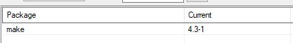
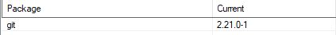
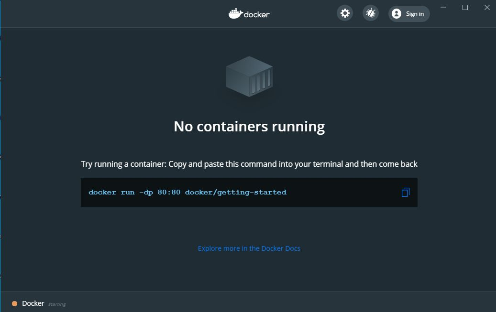
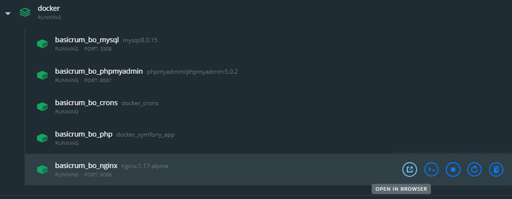

# Windows prerequisites for running Basic RUM locally

We prepared a list of steps that will enable new developers on Windows to be run and develop Basic RUM locally.

 1. Install Cygwin from here https://www.cygwin.com .
 2. Selected **make** and **git** when selecting Cygwin packages.
 
 
 3. Install Docker Desktop for Windows and make sure it is running. You should be able to see the empty docker dashboard if docker is running:
 
 4. Open Cygwin terminal and navigate to your project folder.
 5. Clone the Basic RUM backcoffice repository.
 6. Run the **"make init"** command, follow the instructions for user creation and, if there are no errors in the terminal, you should be able to see the docker container running:
 
 7. Open http://localhost:8086/ or click on the "Open in browser" button in the **basicrum_bo_nginx container** to view the back-office:
 
 8. If you like to have the demo data installed, run the **"make demo"** command in the Cygwin terminal.
 9. After the initial install process is completed you can use the Cygwin terminal "make up" command to start your docker instance again when needed (e.g. after Windows restart).

